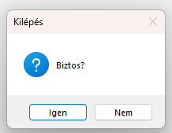
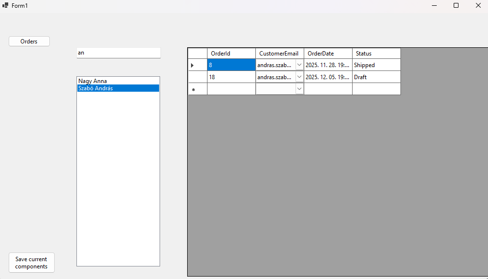
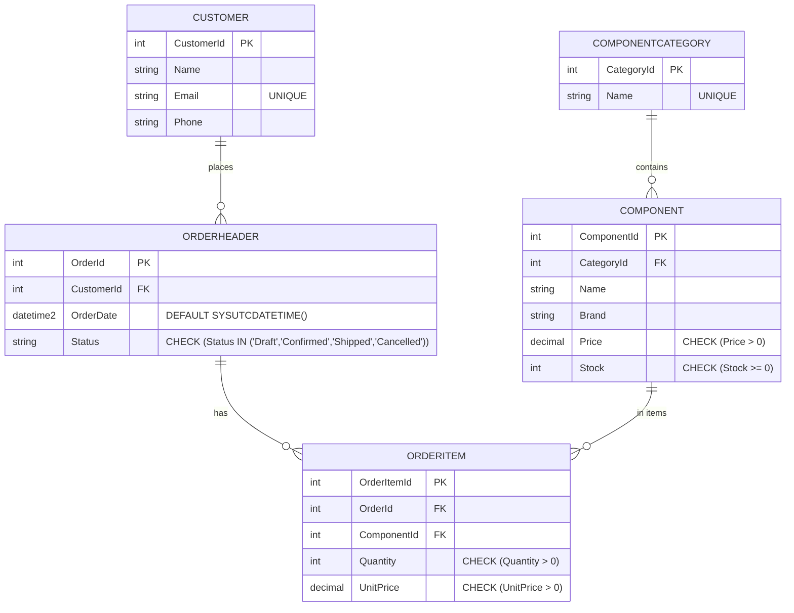
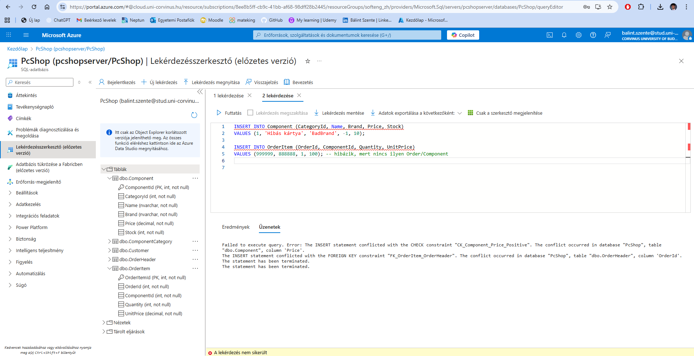
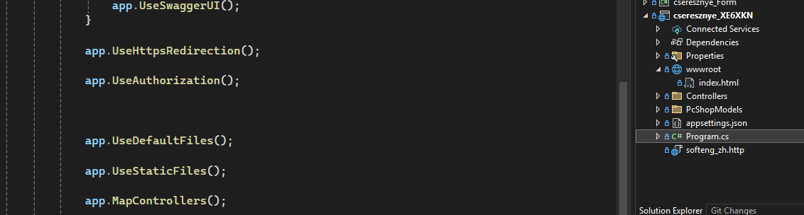
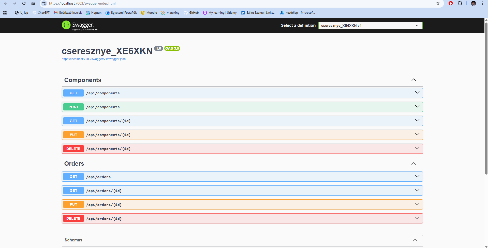
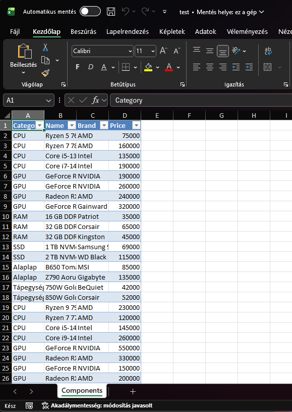

# Pontozólap
Név: Szente Bálint

Neptun: XE6XKN

## Projekt rövid leírása:

Számomra pont aktuális, így egy PC építő webshop minimális webapplikációját készítettem el. Megtalálhatóak az alap CRUD végpontok a `Component` tábla adataival, továbbá lekérdezhető az `OrderHeader` tábla és szerkeszthető a rekordok státusz mezője. A solutionben helyet foglal egy Windows Forms applikáció is, mely szűrhetően jeleníti meg a vásárlók (`Customer` tábla) neveit. Itt kattintásra egy panelbe töltött UserControlon jelennek meg az adott vásárló rendelései.

> [!WARNING]
> Az SQL adatbázis csak egyetemi VPN alól érhető el.  


---

### Windows Forms Application

##### User Interface 

- `1x2p` Az alkalmazásból a **kilépés csak megerősítő kérdés után** lehetséges. 
- `1x2p` Olyan alkalmazás **elrendezés, melyben gombok lenyomására UserControl-ok kerülnek elhelyezésre egy Panel vezérlőben**, teljesen kitöltve azt. Minden gombra jár a pont, amennyiben az funkcionalitással rendelkező UserControl-t tölt be. 



```csharp
private void button1_Click(object sender, EventArgs e)
{
    panel1.Controls.Clear();
    OrderControl uc = new();
    uc.Dock = DockStyle.Fill;
    panel1.Controls.Add(uc);
}
```

Részösszeg: `4p`
Összesen: `4p`

##### Tábla adatainak megjelenítése `ListBox`-ban. 

- `1x2p` Adatok  megjelenítése 
- `1x2p` Ha az adatok tetszőleges módszerrel, pl. `TextBox`-on keresztül szűrhetőek. 

Részösszeg: `4p`
Összesen: `8p`

##### Tábla adatainak megjelenítése `DataGridView`-ban 

- `1x2p` Adatok  megjelenítése 
- `1x2p` Ha a tábla idegen kulcsot is tartalmaz, melynek megjelenítése `DataGridViewComboBoxColumn`-on keresztül történik. 

 ez az előző pontra is jó screen, itt az order táblánál a CustomerId-ból navigálta a customer tábla email mezőjére, a headert is átírtam.

Részösszeg: `4p`
Összesen: `12p`

##### Adatkötés `BindingSource` -on keresztül

- `1x2p` Működő  `BindingSource` 
- `3x1p` Egy `BindingSource`-ra egy gyűjtemény megjelenítésére alkalmas vezérlő (ListBox, ComboBox, DataGridView) mellett más adatkötött vezérlő is van kötve, mint `TextBox`, `DateTimePicker`, `ComboBox` idegen kulcs értékének beállítására, stb. 

A felső kép mutatja, `TextBox`, `ListBox`, `ComboBox`. Mindháromra a customerBindingSource van kötve. 

Részösszeg: `5p`
Összesen: `17p`

## Hozott anyagok:

##### Saját Adatbázis


- `3x1p` Az alkalmazásban használt táblánként pont (`Component`, `OrderHeader`, `Customer`)
- `1p` Az adatbázis tartalmaz Constraint-eket (min 2)
- `2p` Az adatbázis saját Azure SQL szerveren van
- `1p` Az adatbázis adatainak forrásmegjelölése értsd: miből készült és hogyan: Az adatbázis tartalmaz pc alkotó alkatrészeket, a webshop ezek árusításával foglalkozik. Továbbá kategorizálhatóak a bizonyos alkatrészel. A vásárlók tábla tartalmazza az összes regisztrált vásárlót, akik össze vannak kötve egy nagy rendelés táblával, melyeben szerepel minden releváns információ a rendelésekről. Szerepel egy n-n kapcsolattal rendelkező tábla, mely gyakorlatilag kapcsoló táblaként szerepel (`OrderItem`). A tábla teszt adatait generatív mesterséges intelligenciával készítettem, figyelve a kényszerek betartására. 





Részösszeg: `7p`
Összesen: `24p`

### Egyéb, extra

- `2x1p`  `Scaffold-DbContext` használata 
- (mind a web mind a form projekt használja)

Részösszeg: `2p`
Összesen: `26p`


### ASP .NET 

- `2p`  `program.cs` beállítása `wwwroot` mappában tárolt statikus tartalmak megosztására



Részösszeg: `2p`
Összesen: `28p`

##### API végpontok


- `3p` Teljes SQL tábla adatainak szolgáltatása API végponton keresztül (`api/components`), (`api/orders`) GET
- `2x2p` SQL tábla egy választható rekordjának szolgáltatása API végponton keresztül (`api/components/{id}`), (`api/orders/{id}`) GET
- `3p` SQL tábla egy választható rekordjának törlése (`api/components{id}`, `api/orders{id}`) DELETE PS.: A DELETE végpontok esetén az adatbázisban fennálló idegen kulcsos kapcsolatok miatt a törlés csak olyan rekordokon hajtható végre, amelyeket más táblák nem referálnak. Ez szándékos viselkedés, a hivatkozási integritás védelme érdekében.
- `5p` Új rekord felvétele `HttpPost` metóduson keresztül SQL táblába (`api/components`) POST 
- `2x3p` Rekord módosítása `HttpPost` metóduson keresztül SQL táblában  (`api/components/{id}`), (`api/orders/{status}`) Ezeket én PUT metódussal vittem véghez, hiszen ez való a változtatásra. (PS.: részleges változtatásra, mint csak a status mező, PATCH metódus lenne helyes) 

PS.: Az API végpontok közvetlenül az Entity Framework Core által scaffoldolt entitásosztályokat használják request-modellként. Emiatt a Swagger felületen a navigation property-k is megjelennek a POST/PUT példákban, ami a kézi tesztelést nehezíti. A backend logika ettől függetlenül helyesen működik, az adatbázis hivatkozási integritását pedig az idegen kulcsok biztosítják.



Részösszeg: `21p`
Összesen:  `49p`

##### Diagram rajzolása, Excel munkafüzet generálása

- `1x7p` Excel munkafüzet generálása kódból, adatbázstába tartalmának megjelenítésével, legalább egy formázással



Itt még a WinFormson feltüntetett gombbal lehet lementeni a Components tábla fontos mezőit. Mivel .InsertTable() metódust használtam a formázás magától megvan ;) 

> [!WARNING]
> Excel fájlba mentésnél fontos megadni a .xlsx kiterjesztést a fájlnévnél

Részösszeg: `7p`
Összesen:  `56p`

## Összessen: 56 pont
